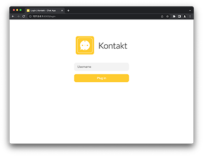
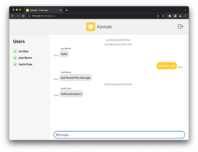

# Kontakt - Chat App

> Web realtime chat application using Socket IO communication

[](https://forthebadge.com) [](https://forthebadge.com)

This application was created for learning purposes. The goal of this project is to make the web chat where users can join in and message each other in real time.

This is a Flask web application. When user logs in, his username is stored in server session and client's cookie. Messages are sent using socket io communication - data is sent to the server and broadcast from there to all connected users. Messages are not stored in any database - when user logs out he can't see them anymore and also when he logs in he can't see previous messages. Like plug in to the electric socket.

 

## Technologies

This project was built with Python v3.11.1 and uses following technologies:

- [Flask](https://flask.palletsprojects.com/en/2.2.x/) (v2.2.3) - python framework for web development
- [flask-socketio](https://flask-socketio.readthedocs.io/en/latest/) (v5.3.2) - two-directional communication between the clients and the server
- [flask-session](https://flasksession.readthedocs.io/en/latest/) (v0.4.0) - support for server-side session and cookies
- [javascript](https://developer.mozilla.org/en-US/docs/Web/JavaScript) (ES6) - frontend of the client application

## Live Demo

You can see and test finished, deployed version of the app at the [https://kontakt-app.herokuapp.com](https://kontakt-app.herokuapp.com)

## Development setup

Follow the steps below to get started with this project's development environment.

> _Note_: this instruction assumes you have python installed on your computer

1. Clone this repository and navigate into it.

```sh
$ git clone https://github.com/mattkepa/kontakt-chat-app.git
$ cd kontakt-chat-app
```

2. Create python virtual environment.

```sh
$ python -m venv .venv
```

3. Activate virtual environment.

- MacOS / Linux

```sh
$ source .venv/bin/activate
```

- Windows

```sh
$ .\.venv\Scripts\activate
```

4. Install project's dependecies.

```sh
$ pip install -r requirements.txt
```

5. Run server.

```sh
$ python main.py
```

6. Open app in web browser (`http://127.0.0.1:5000`).

> _Note_: you can connect to app from other devices in the same local network - type http://[local IP address]:5000 in web browser ([local IP address] - computer's local IP where server is running)

> _Note_: for development purposes you must have file with environment variables (see instruction below)

### Env file configuration

Create `.env` file in project's root folder

```
TESTING=False
DEBUG=True
SECRET_KEY=<secretkeystring>
SERVER=0.0.0.0
```

## Inspiration

This app is based on [_Coding Livestream - Creating an Online Chat App w/ Python!l_](https://www.youtube.com/watch?v=i824zN0DGIo&t=5910s) by [@Tech With Tim](https://www.youtube.com/@TechWithTim).

## License

All code is released under the [MIT](./LICENSE) License.
